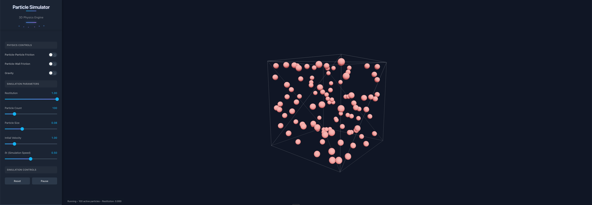

# Particle Lab

A browser-based, GPU-accelerated educational **physics lab** for particle simulations — built with
React, Three.js (WebGPU + WebGL2 fallback), and React Three Fiber. Pick a model, tune it live, measure
what's happening, and share or record the result.

## Screenshot



## Live demo

<https://pouyanjay.github.io/particlesimulator>

## What's inside

**Simulation modes** (each a self-contained plugin):

- **Elastic gas** — equal-mass spheres bouncing elastically; converges to Maxwell–Boltzmann, verifies P·V = N·k·T.
- **Molecular dynamics** — a Lennard-Jones gas (velocity Verlet); ideal-gas behaviour, phase changes, optional real-substance units (Argon/Ne/Kr/Xe).
- **N-body gravity** (CPU) and **GPU N-body** (WebGPU compute, tens of thousands of bodies).
- **Particle Life** — asymmetric attraction/repulsion between types; emergent lifelike structure.
- **Boids** — flocking from separation/alignment/cohesion.
- **Electrostatics** — charged particles under Coulomb's law.

**The lab around them:**

- **Measurement** — live temperature, pressure, energy, momentum readouts; a Maxwell–Boltzmann speed
  histogram; energy/speed charts; an ideal-gas (PV = NkT) check.
- **Pedagogy** — per-mode explainers, **guided challenges** (predict-then-observe, auto-graded against
  telemetry), and a **curated scenario gallery**.
- **Save & share** — named presets, JSON import/export, and shareable links that encode the whole
  scenario in the URL; an `?embed` mode for clean iframes.
- **Undo/redo**, a **command palette** (⌘K), 2D/3D views, and a first-visit tour.
- **Record & export** — capture the canvas to MP4/WebM/GIF, grab PNG screenshots, and export telemetry
  to CSV/JSON.
- **Reach** — installable, offline-capable **PWA**; mobile/touch support; keyboard-operable and
  WCAG-AA-minded; an optional physics-in-worker path (`?worker`).

## Tech stack

React 19 · Vite 6 · TypeScript (strict) · `@react-three/fiber` 9 · `three` 0.184 `WebGPURenderer` (TSL
compute) with WebGL2 fallback · Zustand (+ zundo) · XState · uPlot · `vite-plugin-pwa`. Physics lives in
a pure-TS `sim-core` with no React/three dependencies. See [docs/architecture.md](./docs/architecture.md).

## Development

Prerequisites: Node.js 18+ and npm.

```bash
npm install      # install dependencies
npm run dev      # Vite dev server (http://localhost:5173)
npm test         # Vitest unit + component tests
npm run lint     # ESLint
npm run build    # tsc -b && vite build → dist/
```

Useful URL flags: `?forceWebGL` (force the WebGL2 backend), `?stats` (dev-only profiling overlay),
`?worker` (run CPU-mode physics in a Web Worker), `?embed` (chrome-less embed view), and a share link's
`#s=…` hash (restore a scenario).

## Documentation

- [docs/architecture.md](./docs/architecture.md) — the layered architecture and data flow.
- [docs/adding-a-sim-mode.md](./docs/adding-a-sim-mode.md) — how to add a new simulation mode.
- [docs/qa-checklist.md](./docs/qa-checklist.md) — launch QA: verified items + manual cross-browser matrix.

## Deployment

Automatic deployment to GitHub Pages via GitHub Actions (`.github/workflows/deploy.yml`): the workflow
builds and publishes `dist/` on every push to `main`. Enable Pages → Source: "GitHub Actions" in the
repository settings. The build derives its base path from the repository name, so WebGPU and the PWA
work under the Pages sub-path.

## License

MIT.
