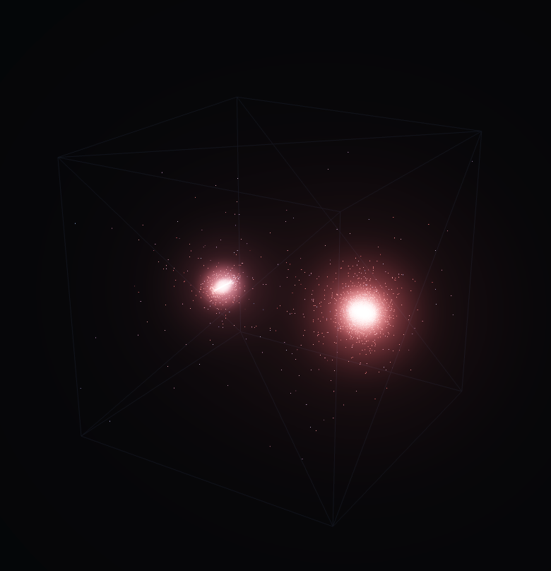
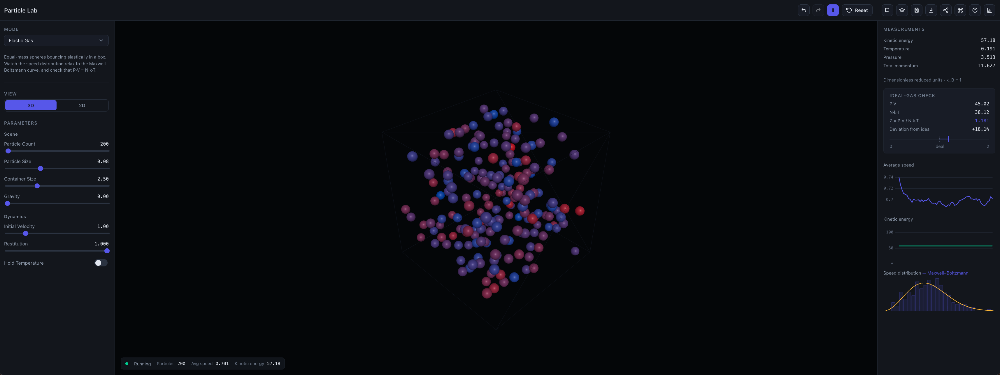
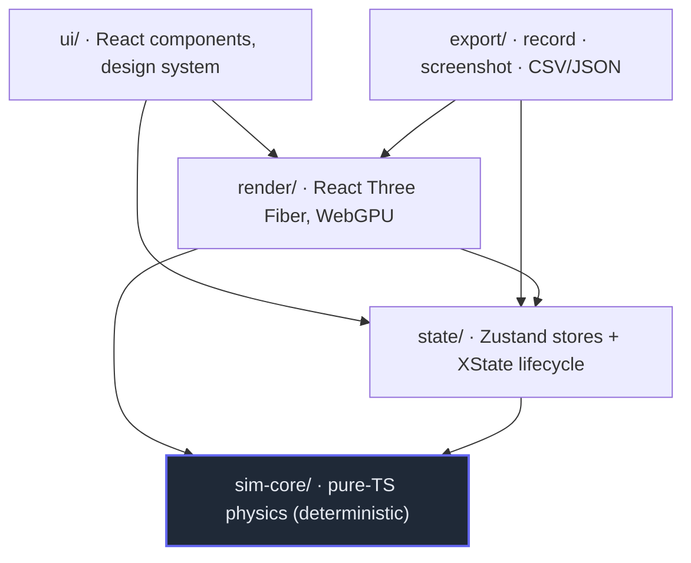

<div align="center">

# Particle Lab

**A browser-based, GPU-accelerated educational physics lab for particle simulations.**

Pick a model, tune it live, measure what's happening, then share or record the result.

[](https://github.com/PouyanJay/particlesimulator/actions/workflows/deploy.yml)
[](./LICENSE)


[**▶ Live demo**](https://pouyanjay.github.io/particlesimulator) · [Watch a recording](https://github.com/PouyanJay/particlesimulator/raw/main/public/demo.mp4)

<table>
  <tr>
    <td align="center" valign="middle">
      <a href="./public/demo-1.png"></a>
    </td>
    <td align="center" valign="middle">
      <a href="./public/demo-2.png"></a>
    </td>
  </tr>
  <tr>
    <td align="center"><sub><b>GPU N-body</b> — 20K+ bodies</sub></td>
    <td align="center"><sub><b>The full lab</b> — parameters · canvas · live measurements</sub></td>
  </tr>
</table>

</div>

---

## Table of contents

- [Overview](#overview)
- [Features](#features)
- [Simulation modes](#simulation-modes)
- [Architecture](#architecture)
- [Tech stack](#tech-stack)
- [Getting started](#getting-started)
- [Configuration & URL flags](#configuration--url-flags)
- [Project structure](#project-structure)
- [Testing](#testing)
- [Deployment](#deployment)
- [Documentation](#documentation)
- [License](#license)

## Overview

Particle Lab turns particle physics into something you can *play with and measure*. It runs several
simulation models — gases, gravity, flocking, particle life, electrostatics — entirely in the browser,
on the GPU where it helps, and wraps them in a real instrument: live readouts, charts, a Maxwell–Boltzmann
histogram, conserved-quantity checks, guided challenges, and a curated scenario gallery.

It is engineered as a **proper application, not a demo**: a strictly layered architecture, a pure and
deterministic physics core covered by ~400 tests, a token-based design system, and a shareable/recordable
output pipeline. It renders through Three.js's **WebGPU** path with an automatic **WebGL2 fallback**.

## Features

**Simulation & rendering**
- Seven simulation modes behind a uniform plugin contract (see [below](#simulation-modes)).
- WebGPU compute for the heavy modes; instanced rendering with HDR bloom; 2D and 3D projections.
- Deterministic, fixed-timestep physics — same seed + parameters produce the same run.

**Measurement & pedagogy**
- Live temperature, pressure, energy, and momentum readouts; speed/energy charts (uPlot).
- A **Maxwell–Boltzmann** speed histogram and an ideal-gas **PV = N·k·T** check.
- Per-mode explainers, a **curated scenario gallery**, and **guided challenges** that auto-grade your
  predictions against live telemetry.

**Workflow**
- **Save & share** — named presets, JSON import/export, and links that encode the entire scenario in the
  URL hash; an `?embed` view for clean iframes.
- **Record & export** — capture the canvas to MP4 / WebM / GIF, take PNG screenshots, and export telemetry
  to CSV / JSON.
- **Undo/redo**, a **command palette** (`⌘K`), a first-visit tour, and full keyboard operability.

**Reach & quality**
- Installable, **offline-capable PWA**; responsive and touch-friendly; WCAG-2.2-AA-minded.
- Optional **physics-in-worker** path to keep the UI at 60 fps under load.
- Strict TypeScript, ~400 unit/component tests, and a design-token system (no magic numbers).

## Simulation modes

| Mode | What it demonstrates | Backend |
|---|---|---|
| **Elastic gas** | Elastic collisions → Maxwell–Boltzmann distribution; verifies PV = N·k·T | CPU |
| **Molecular dynamics** | Lennard-Jones gas (velocity Verlet); ideal-gas law, phase changes, real-substance units | CPU |
| **N-body gravity** | All-pairs gravity; spiral discs and gravitational collapse | CPU |
| **GPU N-body** | The same model on the GPU — tens of thousands of bodies in real time | WebGPU compute |
| **Particle Life** | Asymmetric attraction/repulsion between types; emergent lifelike structure | CPU |
| **Boids** | Flocking from separation / alignment / cohesion | CPU |
| **Electrostatics** | Charged particles under Coulomb's law | CPU |

## Architecture

Four strictly-separated layers. The physics core (`sim-core`) is **pure TypeScript** — no React, no
three.js — so it's deterministic and unit-testable in isolation. Everything depends *inward* toward it.



A new simulation is a single registered `SimMode` plugin — adding one needs **zero** changes to the app
shell or render layer. The full picture (per-frame data flow, the session lifecycle machine, and the
scenario save/restore flow) is in **[docs/architecture.md](./docs/architecture.md)**.

## Tech stack

| Area | Choice |
|---|---|
| Language | TypeScript (strict) |
| UI | React 19 |
| Rendering | Three.js `0.184` `WebGPURenderer` (TSL compute) + WebGL2 fallback, via `@react-three/fiber` 9 |
| State | Zustand (+ `zundo` undo/redo), XState (session lifecycle) |
| Charts | uPlot |
| Build / tooling | Vite 6, Vitest, ESLint, `vite-plugin-pwa` |
| Rigid-body physics | Rapier (where used) |

## Getting started

**Prerequisites:** Node.js ≥ 20 and npm. A WebGPU-capable browser is recommended (Chrome/Edge/Safari 26+);
the app falls back to WebGL2 automatically.

```bash
git clone https://github.com/PouyanJay/particlesimulator.git
cd particlesimulator
make run          # installs deps if needed, then opens the dev server → http://localhost:5173
```

Common tasks are wrapped in a `Makefile` (each just calls the matching npm script; run `make help` to
list every target). Use whichever you prefer:

| Task | Make | npm |
|---|---|---|
| Run (install + dev, opens browser) | `make run` | — |
| Dev server | `make dev` | `npm run dev` |
| Production build | `make build` | `npm run build` |
| Preview the build | `make preview` | `npm run preview` |
| Tests | `make test` | `npm test` |
| Lint | `make lint` | `npm run lint` |
| Type-check | `make typecheck` | `npm run typecheck` |
| Pre-commit gate — type-check + lint + test | `make check` | — |
| Full gate — `check` + production build | `make verify` | — |

## Configuration & URL flags

The app reads a few flags from the URL — handy for debugging and embedding:

| Flag | Effect |
|---|---|
| `?forceWebGL` | Force the WebGL2 backend (verify fallback parity) |
| `?stats` | Show the dev-only profiling overlay (FPS / GPU / draw calls) |
| `?worker` | Run CPU-mode physics in a Web Worker |
| `?embed` | Chrome-less view for iframes (also `/embed`) |
| `#s=…` | Restore a shared scenario (set automatically by share links) |

## Project structure

```
src/
  sim-core/   Pure-TS physics: modes, force kernels, integrators, measurement, scenarios, challenges
  render/     React Three Fiber: canvas, sim driver, CPU/GPU renderers, post-FX, worker
  state/      Zustand stores (+ zundo) and the XState session lifecycle
  export/     Recording, screenshots, and CSV/JSON serialization
  ui/         React components — controls/ chrome/ panels/ dialogs/ commands/ charts/ hooks/
  styles/     Design tokens (tokens.css) + canvas color mirror (theme.ts)
docs/         Architecture, "add a SimMode" guide, QA checklist
```

## Testing

The physics core is verified by **invariants, not snapshots** — conservation laws, analytic convergence
(e.g. the speed distribution approaching Maxwell–Boltzmann), integrator stability, and determinism. UI and
store logic are covered with Vitest + React Testing Library. GPU and visual paths are verified in-browser.

```bash
make test            # run once     (npm test)
make test-watch      # watch mode   (npm run test:watch)
make coverage        # coverage     (npm run test:coverage)
```

## Deployment

Continuous deployment to **GitHub Pages** via GitHub Actions
([`.github/workflows/deploy.yml`](./.github/workflows/deploy.yml)): every push to `main` builds and
publishes `dist/`. The base path is derived from the repository name, so WebGPU and the PWA work correctly
under the Pages sub-path. To enable: repository **Settings → Pages → Source: GitHub Actions**.

## Documentation

| Document | Contents |
|---|---|
| [docs/architecture.md](./docs/architecture.md) | Layered architecture, per-frame data flow, lifecycle, and scenario flow (with diagrams) |
| [docs/adding-a-sim-mode.md](./docs/adding-a-sim-mode.md) | A TDD-first walkthrough of adding a new simulation mode |
| [docs/qa-checklist.md](./docs/qa-checklist.md) | Launch QA: verified items and the manual cross-browser matrix |

## License

[MIT](./LICENSE) © Pouyan Jahangiri
