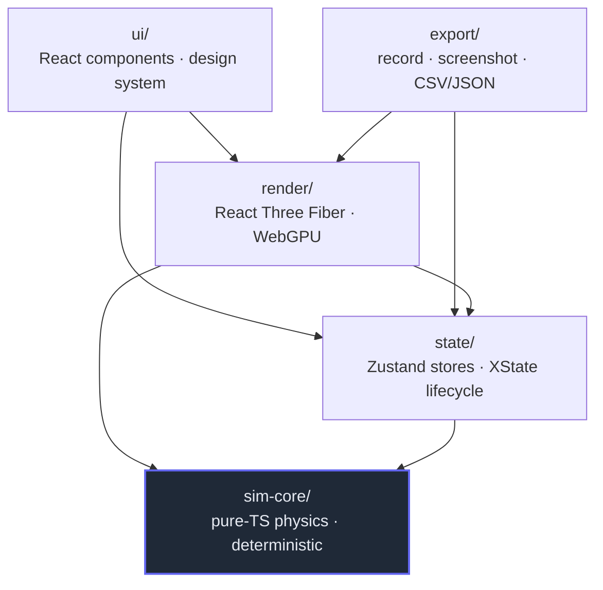
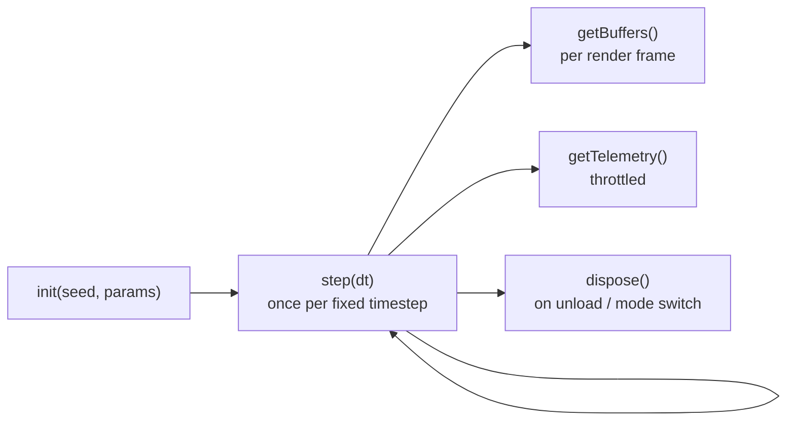
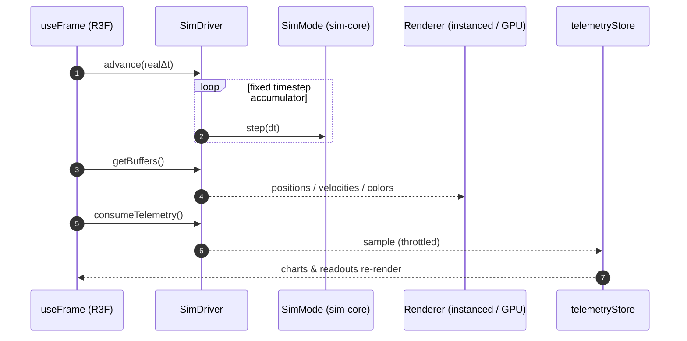
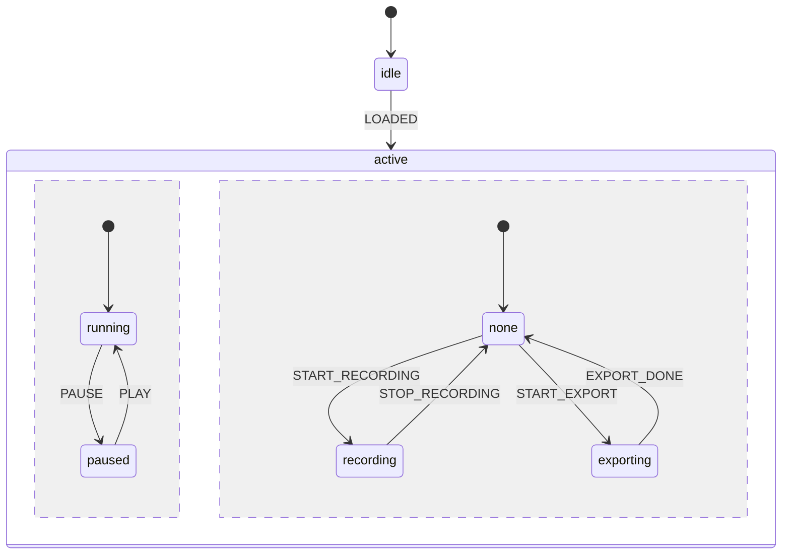
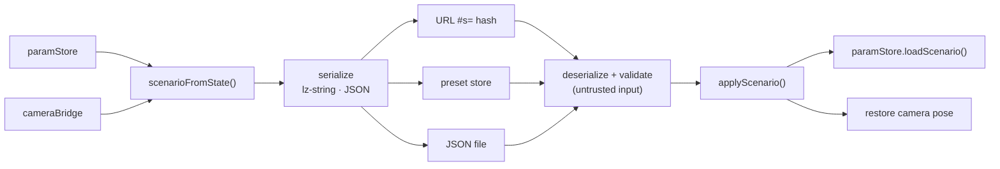

# Architecture

Particle Lab is built in four strictly-separated layers. The separation is the point: it's what lets a
new simulation drop in without touching the app shell or the renderer, keeps the physics deterministic
and unit-testable, and keeps the 60 fps render loop from ever re-rendering React.

## Layers

Everything depends *inward* toward `sim-core`, which depends on nothing. Rule of thumb: if a file imports
`three`/`@react-three/*` it belongs in `render/`; if it imports React it belongs in `render/`, `state/`,
or `ui/` — **never `sim-core/`**.

| Layer | Responsibility | May import |
|---|---|---|
| `sim-core/` | Simulation state & stepping; pure, deterministic | (nothing) |
| `state/` | Zustand stores + XState lifecycle | `sim-core` |
| `render/` | Draw sim state each frame; no business logic | `sim-core`, `state` |
| `ui/` | Panels, dialogs, controls; no three.js | `state`, `render`, `sim-core` |
| `export/` | Recording / screenshot / data export | `render`, `state`, `sim-core` |

## sim-core — the physics core (pure TS)

Deterministic given `(seed, params)`; this is where most of the ~400-test suite lives. Key pieces:

- **`types.ts`** — the `SimMode` plugin contract, parameter-schema types, `ParticleBuffers`, `Telemetry`.
- **`registry.ts`** — register a mode factory, list modes, construct one by id. The UI/render layers only
  ever see this generic registry, so adding a mode is a one-line registration.
- **`modes/`** — one file per simulation. **`physics/`** — reusable force kernels, the spatial-hash grid,
  environment helpers. **`integrators/`** + **`time/`** — semi-implicit Euler / velocity Verlet and the
  fixed-step accumulator. **`measure/`** — conserved quantities, Maxwell–Boltzmann, substances.
- **`scenario.ts`** — the serializable unit of save/share. **`scenarios/`**, **`challenges/`** — curated
  gallery data and the guided-challenge model (pure; the UI renders them).

### The `SimMode` plugin contract

Every simulation implements one interface and is driven by the render layer:

`init` seeds all RNG and allocates from the parameters; `step` advances exactly `dt`; `getBuffers` returns
xyz-interleaved positions (+ optional velocities/colors) for rendering; `getTelemetry` returns measured
quantities for the charts. Adding a mode requires **zero** changes elsewhere — see
[adding-a-sim-mode.md](./adding-a-sim-mode.md).

## render — React Three Fiber

Reads from `sim-core` and draws; holds no physics.

- **`SimulationCanvas.tsx`** — the `<Canvas>`, lighting, container, a single perspective camera + orbit
  controls (2D = the same camera, top-down, rotation locked), and the `CameraRig`.
- **`simDriver.ts`** — a framework-agnostic loop (load a `Scenario`, advance on a fixed timestep, sample
  telemetry). No three.js, no React — the testable core of the render layer.
- **`ParticleField.tsx`** dispatches by backend: CPU modes → `CpuParticles.tsx` (instanced mesh driven by a
  `SimDriver`); `webgpu-compute` → `gpu/GpuNbody.tsx` (GPU-resident sim + sprites).
- **`PostFx.tsx`** — mode-aware HDR bloom. **`worker/`** — the optional physics-in-worker path. Bridges
  (`cameraBridge`, `canvasBridge`) expose the live camera/canvas to other layers without prop-drilling.

### Per-frame data flow

The hot loop reads parameters via `store.getState()` — never via props — so playback never re-renders the
React tree.

## state — Zustand + XState

- **`paramStore.ts`** — the scenario source of truth (mode, seed, params, substance, view); persisted, and
  wrapped with **zundo** for undo/redo (tracks the scenario slice only — playback is excluded).
  `paramHistoryGroup.ts` coalesces a slider drag into one undo step.
- **`telemetryStore.ts`** — transient measured quantities (never persisted, never undoable).
- **`presetStore.ts`**, **`onboardingStore.ts`**, **`uiStore.ts`** (which overlay is open).
- **`lifecycleMachine.ts`** — an XState machine modelling the session as two parallel regions:

`isPlaying` in `paramStore` remains the sim-loop authority and syncs into the machine; the machine
coordinates the record/export UI (and forbids starting a second export mid-export).

## ui — components & design system

Token-styled React components grouped by role: **`controls/`** (shared primitives — `Button`, `Dialog`,
`Tabs`, `Tooltip`, `TextField`, `ButtonGroup`, `Kbd`, the `roving` helper), **`chrome/`** (app frame),
**`panels/`** (instrument panels), **`dialogs/`** (overlays), **`commands/`** (command palette),
**`charts/`** (uPlot wrappers), **`hooks/`**. The design system lives in `src/styles/` — `tokens.css` for
the DOM and `theme.ts` for the canvas colour mirror. No three.js in this layer.

## Scenario save / share / restore

A scenario — `{ modeId, seed, params, substanceId, camera, view }` — is the unit of persistence. Raw
particle state is never serialized; the seed + parameters regenerate the run.

`applyScenario` (render layer) bridges the store and the camera: it loads the mode/params/seed and, when
the mode or projection changes, queues the saved camera pose so it overrides the default framing.
